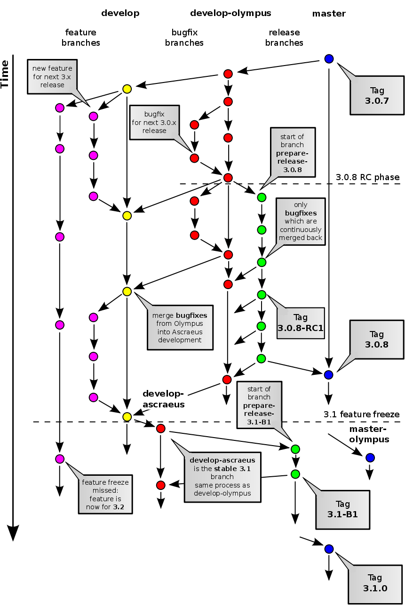

===
Git
===

phpBB uses Git for its version control system. The phpBB Git repository
is hosted on GitHub at `<https://github.com/phpbb/phpbb>`_.

This documentation explains how to contribute to phpBB development:

- `Basics`_
- `Branch Names`_
- `Commit Messages`_
- `Developers`_
- `Windows`_
- `Further reading`_
- `External links`_

Basics
======

phpBB Repository
----------------

Forking and Cloning
+++++++++++++++++++
To contribute to phpBB development, you should sign up for a
`GitHub <https://github.com>`_ user account if you don't already have one.

Begin by forking the phpBB repository to your account, by clicking the
"Fork" button at phpBB's repository.

Clone your fork of phpBB's repository to your computer:
``git clone git://github.com/<my_github_name>/phpbb.git``

See `Set Up Git <https://help.github.com/articles/set-up-git>`_ for help on setting up Git.

Branches
++++++++
- `master <http://github.com/phpbb/phpbb3/tree/master>`_ - The latest unstable development version with new features etc.
- `3.2.x <http://github.com/phpbb/phpbb3/tree/3.2.x>`_ - Development branch of the 3.2 line. Bug fixes and minor feature changes are applied here.
- `3.1.x <http://github.com/phpbb/phpbb3/tree/3.1.x>`_ - Development branch of the stable 3.1 line. Bug fixes are applied here.
- `3.0.x <http://github.com/phpbb/phpbb3/tree/3.0.x>`_ - Development branch of the stable 3.0 line. phpBB 3.0 has reached its End of Life and is therefore no longer maintained.
- `2.0.x <http://github.com/phpbb/phpbb3/tree/2.0.x>`_ - Development branch of the deprecated 2.0 line.

Tags
++++
Tags are released versions. Stable ones get merged into the master branch.

- release-3.Y.Z-aX - Alpha release X of the 3.Y.Z line.
- release-3.Y.Z-bX - Beta release X of the 3.Y.Z line.
- release-3.Y.Z-RCX - Release candidate X of the stable 3.Y.Z release.
- release-3.Y.Z - Stable 3.Y.Z release.
- release-2.0.X - Deprecated stable 2.0.X release.

This means all bug-fix development should take place on the 3.1.x branch, and
will be merged into higher branches, including master. All feature development
should take place in master. Read more about the workflow in the next section.

How to contribute?
++++++++++++++++++
When fixing a bug, please post in the `bug tracker <https://tracker.phpbb.com>`__.
When adding a feature to 3.x post your patch for review in a new topic on the
`[3.x] Discussion forum <http://area51.phpbb.com/phpBB/viewforum.php?f=81>`__ at
Area51. Please either provide a link to your commit or branch on GitHub or
attach a patch created with ``git format-patch``. For larger features or changes
consider posting an RFC on Area51 first.

Branch Names
============
Feature branches should be called **feature/feature-name**. Bug or minor
improvements do not need a name, their branches should be called **ticket/1234**
with the correct ticket id. If you want to give something a name that is not a
feature you may use **task/task-name**. When these branches go into the main
phpBB repository they are renamed **<category>/<user>/<name-or-id>** or
**user/<category>/<name-or-id>** to make clear from which developer's repository
the branch was merged.

Commit Messages
===============
You should always `create a ticket <https://tracker.phpbb.com>`_ before starting work.
It is important that every commit references a ticket. It does not matter what state
that ticket is in. No line should contain more than 79 characters. The first line
should be followed by a blank line. This means you should not break the first sentence
of your message! The purpose of this is to maintain useful --oneline logs which only
display the first line of every message. A good commit message then looks like this:

.. code-block:: text

    [branch you are working on] A short explanation of the change.

    A more detailed explanation of which things exactly were changed and for
    what reasons.

    This can span multiple paragraphs for a bigger change. And
    it should really make clear all the changes to anyone reading this commit
    message without further context.

    TICKET-ID

An example:

.. code-block:: text

    [feature/request-class] Adding request class ported from ascraeus-experiment.

    The well known request_var function is now a wrapper that calls a method
    on a phpbb_request object. The class provides additional functionality.
    It can replace all super globals with special objects that throw errors
    when being accessed. They still allow isset operations to keep backward
    compatibility with isset($_POST['var']) checks. The phpbb_request class
    implements the phpbb_request_interface which is available for easy mocking
    of input in tests.

    PHPBB3-1234

The structure of a commit message which is verified by the commit-msg hook is as follows:

.. code-block:: text

    [<branch>] 

    <description>

    <ticket1>
    <ticketn>

The required components are the summary, branch, and list of tickets; the description
is optional. Both the description and ticket list must be preceded by a **single** empty
line. The description element is unrestricted length and may contain any number of empty
lines to separate paragraphs; each ticket in the list must be on its own line. If the
branch is a [ticket/] branch, the ticket list must contain a matching ticket, finally
the ticket list may not contain any duplicates.

Developers
==========
Review `Forking and Cloning`_.

Configuration
-------------
Git
+++
Add your Username to Git on your system:

::

    git config --global user.name "Your Name Here"

Add your E-mail address to Git on your system:

::

    git config --add user.email username@phpbb.com

Add the upstream remote (you can change 'upstream' to whatever you like):

::

    git remote add upstream git://github.com/phpbb/phpbb.git

.. note::
    The *upstream* remote url **is** the phpbb GitHub repo. Your cloned
    fork of the phpbb GitHub repo will, by default, use the *origin* remote url.

Composer
++++++++
To be able to run an installation from the repo (and not from a pre-built package) you
need to run the following shell commands to install phpBB's dependencies.

::

    cd phpBB
    php ../composer.phar install

Ignore any *abandoned package* warnings.

.. seealso::

    `Introduction - Composer <https://getcomposer.org/doc/00-intro.md>`_ for
    further information.

Hooks
+++++
The phpBB repository contains some client-side hooks that can aid development. They are
located in the ``git-tools/hooks`` directory. These hooks do things like preparing and
validating commit messages, checking for PHP syntax errors. There is a script to set
them up (which symlinks them into ``.git/hooks``).

::

    cd git-tools/hooks
    ./install

In case you get an error, stating the hooks already exist. Simply remove all files from ``.git/hooks``
and re-run the install command.

Once these hooks are installed, you simply need to run ``git commit`` to commit new
changes. Depending on your environment, you will be prompted to add a commit message
using `Vim <http://vimdoc.sourceforge.net/htmldoc/>`__ or
`Emacs <https://www.gnu.org/software/emacs/manual/html_node/emacs/Help.html>`__. The
hooks will take care of formatting your entire commit message in the required format
(see `Commit Messages`_).

Creating local branches
-----------------------
To work on phpBB you need to create local branches of whichever develop branch (e.g. *master*)
you need. Issue the following command to perform this operation:

::

    git checkout -b master origin/master

Workflows
---------

Pulling in upstream changes
+++++++++++++++++++++++++++
You will need to merge in changes made to the upstream repository for them to appear in
your fork, the steps to do this follow. I'm assuming you are performing this on the **master**
branch, but it could be a bug fix branch or a develop release branch, so ensure you are on
the correct branch using ``git branch`` and change with ``git checkout`` if required.

  1. Pull the changes from the upstream **master** branch:
  ::

    git pull upstream master

  2. Push the changes back to your fork (substitute master for the current branch):
  ::

     git push origin master

The following image visualises the phpBB 3 branching model. It may help you to understand the
different branches this section refers to later.

Bug fixing
++++++++++
Ensure you are using the correct develop branch (e.g. *3.1.x*) first and not the *master*
branch. In this example we are using 3.1.x.

.. code-block:: shell

    git checkout 3.1.x # Checkout the base branch 3.1.x or 3.2.x
    git branch ticket/12345 # Create a new branch for your bug fix
    git checkout ticket/12345 # Switch to the new branch
    # Make your changes
    git add <files> # Stage the files
    git commit # Commit staged files - please use a correct commit message
    # Make more changes & commits if necessary
    git push origin ticket/12345 # Push the branch back to GitHub

Starting a new feature
++++++++++++++++++++++
Ensure you are using the correct develop branch (e.g. *master*) first.  In this example
we are using master.

.. code-block:: shell

    git checkout master # Checkout the base branch
    git checkout -b feature/my-fancy-new-feature # Create a new branch for your feature & switch to it
    # Make your changes
    git add <files> # Stage the files
    git commit # Commit staged files - please use a correct commit message
    # Make more changes & commits
    git push origin feature/my-fancy-new-feature # Push the branch back to GitHub

Collaborating with other developers on a feature
++++++++++++++++++++++++++++++++++++++++++++++++
You have pushed a new feature to GitHub and another developer has worked on it. This is
how you can integrate their changes into your own feature branch.

.. code-block:: shell

    git remote add otherdeveloper git://github.com/otherdeveloper/phpbb.git # Add the other developer's repository as a remote
    git fetch otherdeveloper # Fetch otherdeveloper's changes
    git checkout feature/my-fancy-new-feature # Switch to the feature branch
    git merge otherdeveloper/feature/my-fancy-new-feature # Merge otherdeveloper's changes into your feature branch
    # If necessary resolve conflicts & commit
    git push origin feature/my-fancy-new-feature # Push the branch back to GitHub

Merging a feature or bugfix branch
++++++++++++++++++++++++++++++++++
Once a feature or bug-fix is complete it can be merged back into the master branch. To preserve
history we never fast-forward such merges. In this example we will merge the bug-fix created
earlier into 3.1.x. We then merge the changes into 3.2.x and then merge 3.2.x into master
to keep these branches up to date.

.. code-block:: shell

    git checkout 3.1.x # Branch we want to merge into, pull in upstream changes first.
    git merge --no-ff remote/ticket/12345 # Merge remote branch without fast forward
    git checkout 3.2.x # Branch we want to merge into, pull in upstream changes first.
    git merge --no-ff 3.1.x # Merge to keep the 3.2.x branch in sync
    git checkout master # Branch we want to merge into, pull in upstream changes first.
    git merge --no-ff 3.2.x # Merge to keep the master branch in sync
    git push origin 3.1.x 3.2.x master # Push the three changed branches back to GitHub

Additionally the merge.log config setting of Git is set to true, producing a summary of merged commits.

Merging into phpBB repository
+++++++++++++++++++++++++++++
This *only* applies to Development Team Members. The following steps should be taken when
merging a topic branch into the phpBB repository.

.. note::

    Note that tests should be run prior to merging to the official repository. Tests are run
    for each push to a pull request by `Travis (Continuous Integration) <https://travis-ci.org/phpbb/phpbb>`_
    but it is a good idea to run them yourself as well. For more information, read :doc:`../testing/index`.

Merging only to master
^^^^^^^^^^^^^^^^^^^^^^
.. note::

    The *upstream* remote below is pointing to the official phpBB repository, and *origin* points to your fork.

.. code-block:: shell

    git remote update upstream
    git checkout master
    git reset --hard upstream/master
    git merge --no-ff <author>/<branch> # example: git merge --no-ff naderman/ticket/000000
    git push origin master
    # Before continuing, look at your commit list in your fork to make sure it looks correct.
    # If unsure, ask.
    git push upstream master

Merging to 3.1.x
^^^^^^^^^^^^^^^^
.. warning::

    **ALL** merges to 3.1.x **must** also be merged to 3.2.x and master!

.. code-block:: shell

    git remote update upstream
    git checkout 3.1.x
    git reset --hard upstream/3.1.x
    git merge --no-ff <author>/<branch> # example: git merge --no-ff naderman/ticket/000000
    git push origin 3.1.x
    git checkout 3.2.x
    git reset --hard upstream/3.2.x
    git merge --no-ff 3.1.x
    git push origin 3.2.x
    git checkout master
    git reset --hard upstream/master
    git merge --no-ff 3.2.x
    git push origin master
    # Before continuing, look at your commit list in your fork to make sure it looks correct.
    # If unsure, ask.
    git push upstream 3.1.x
    git push upstream 3.2.x
    git push upstream master

Merging to 3.0.x
^^^^^^^^^^^^^^^^
.. warning::

    **ALL** merges to 3.0.x **must** also be merged to 3.1.x and master!

.. code-block:: shell

    git remote update upstream
    git checkout 3.0.x
    git reset --hard upstream/3.0.x
    git merge --no-ff <author>/<branch> # example: git merge --no-ff naderman/ticket/000000
    git push origin 3.0.x
    git checkout 3.1.x
    git reset --hard upstream/3.1.x
    git merge --no-ff 3.0.x
    git push origin 3.1.x
    git checkout master
    git reset --hard upstream/master
    git merge --no-ff 3.1.x
    git push origin master
    # Before continuing, look at your commit list in your fork to make sure it looks correct.
    # If unsure, ask.
    git push upstream 3.0.x
    git push upstream 3.1.x
    git push upstream master

Merging to 3.1.x and master with different patches
^^^^^^^^^^^^^^^^^^^^^^^^^^^^^^^^^^^^^^^^^^^^^^^^^^
.. warning::

    **ALL** merges to 3.1.x **must** also be merged to master!

1. Patch author creates fix-3.1
2. Patch author merges his fix-3.1 into a fix-master branch
3. Patch author changes fix-master until it works as expected
4. Patch author sends 2 Pull Requests
5. Merger merges Authors fix-3.1 into his 3.1.x
6. Merger merges Authors fix-master into his master
7. Merger merges his 3.1.x into master (should work fast-forward)
8. Merger verifies the results
9. Merger pushes 3.1.x and master to phpbb

Merging to 3.0.x, 3.1.x and master with different patches
^^^^^^^^^^^^^^^^^^^^^^^^^^^^^^^^^^^^^^^^^^^^^^^^^^^^^^^^^
.. warning::

    **ALL** merges to 3.0.x **must** also be merged to 3.1.x and master!

1. Patch author creates fix-3.0
2. Patch author merges his fix-3.0 into a fix-3.1 branch
3. Patch author changes fix-3.1 until it works as expected
4. Patch author merges his fix-3.1 into a fix-master branch
5. Patch author changes fix-master until it works as expected
6. Patch author sends 3 Pull Requests
7. Merger merges Authors fix-3.0 into his 3.0.x
8. Merger merges Authors fix-3.1 into his 3.1.x
9. Merger merges Authors fix-master into his master
10. Merger merges his 3.0.x into 3.1.x (should work fast-forward)
11. Merger merges his 3.1.x into master (should work fast-forward)
12. Merger verifies the results
13. Merger pushes 3.0.x, 3.1.x and master to phpbb

Windows
=======

**If you use git on Windows** you should disable the ``AutoCrlf`` which automatically
translates ``\n`` to ``\r\n``.

**If you don't use TortoiseGit:** To do that you must use the following command:

::

    git config core.autocrlf input

If you want to apply to all repositories you may use the ``--global`` option. Like this:

::

    git config --global core.autocrlf input

The difference is that, if you don't use the global option, any new repository you
create will not have this option properly set for phpBB development which may cause
errors to occur while committing or when executing any php file.

**For those who use** `TortoiseGit <http://code.google.com/p/tortoisegit/>`_
**(and used to work with TortoiseSVN):**

When you use TortoiseGit the first time, you need to disable ``AutoCrlf`` in
*Settings* > *Git* > *Config*, so your line-ends are not changed from LF to CR-LF.
You also need to edit the local ``.git/config`` and add the following code, so you
can correctly merge branches (*you need to do that on every git repository you have*):

::

    [merge]
    	log = True

Create your own SSH key
-----------------------
.. seealso::

    http://help.github.com/win-set-up-git/

TortoiseGit will automatically use the SSH key

.. note::

    I used the OpenSSH option during installation, so I am not sure if this
    works for the other option or if you are supposed to do it some other way.

Clone
-----

Then simply clone the repository to your local system and the rest is mostly
like TortoiseSVN.

Commands
--------

.. csv-table::
    :delim: |

    **Pull** | Grab the updates from upstream
    **Commit** | Commit the changes **locally** (you must Push or Sync to commit the changes to the repository)
    **Push** | Push the changes that were made locally to the online repository
    **Sync** | Pushes/Pulls changes with more options

.. tip::

    Always **Pull** first, then **Commit**, then **Push**; this will help you to not end up
    with merge conflicts.

Further reading
===============

* `Git Community Book (online) <http://book.git-scm.com/>`__
* `Pro Git Book (online) <http://progit.org/book/>`__
* `GitCasts <http://gitcasts.com/>`__
* `Getting Git <http://www.techscreencast.com/tool/versioncontrol/railsconf-git-talk/810>`__
* `RailsConf 2008 <http://en.oreilly.com/rails2008/public/content/home>`__ Git Talk by Scott Chacon
* `Official Git Documentation <http://git-scm.com/documentation>`__
* `Git Crash Course for SVN users <http://git-scm.com/course/svn.html>`__
* `GitHub Guides <http://github.com/guides/home>`__
* `Learn.GitHub <http://learn.github.com/>`__
* `Git for the lazy <http://www.spheredev.org/wiki/Git_for_the_lazy>`__

External links
==============

* `Official Git homepage <https://git-scm.com/>`__
* `GitHub <https://github.com/>`__
* `phpBB GitHub account <https://github.com/phpbb>`__
* `phpBB Extensions GitHub account <https://github.com/phpbb-extensions>`__
* `TortoiseGit <https://tortoisegit.org/>`__ - A windows Git client based on TortoiseSVN
* `TortoiseGit on github <https://github.com/TortoiseGit/TortoiseGit/>`__ - GitHub repository
* `Open Source Contribution Etiquette <http://tirania.org/blog/archive/2010/Dec-31.html>`__
