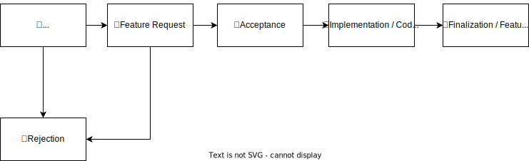

Development Processes
=====================

New Features
------------
This document outlines the process that is in place to propose new features that can be added to phpBB.
phpBB uses this system to assure that a given feature is added as proposed and to make sure that feature requests
are handled transparently by relying on community input.

When proposing features or adjustments to phpBB, there are two possible routes to take:

- **Ideas**
    Generally more informal ideas from a user perspective. Usually short descriptions without too much technical detail.

- **Feature Requests**
    More technical proposal for new features. Should take a deeper look at the technical background
    and ways to implement this new feature. Base for further discussions with the development team.

In the end, both of these will end up following the same general process:

Ideas
^^^^^
Ideas are generally more informal ideas that describe the request for a new feature from the user perspective.
They are aimed at quickly gathering new ideas based on day to day use of phpBB.

Informal Ideas should be proposed in `phpBB Ideas <https://www.phpbb.com/community/ideas>`_.
There it's possible to both gather feedback and support of other users.

More detailed technical discussions should however take place in a *Feature request*.

Feature Requests
^^^^^^^^^^^^^^^^
In contrast to the above mentioned *Ideas*, a *Feature Request* should be focused more on the technical solution for
the proposed feature. They maybe be based on an *Idea* but that is not mandatory.

New feature requests can either be started by creating a ticket in the `phpBB Tracker <https://tracker.phpbb.com/>`_ or
by creating a new discussion topic on the `Area51 Forums <https://area51.phpbb.com/phpBB/>`_.

Try to describe the technical details of the proposed features, how it will be used, and recommendations for an possible
implementation. Include your expectations of the amount of changes that are needed and attempt to discuss the complexity
of the proposal.

Members of the community will be able to participate in the discussion, give their feedback, and help with preparing a
plan on how to best implement the feature in small and easy to track steps.

Feature Acceptance
^^^^^^^^^^^^^^^^^^
After a feature has been accepted by the *phpBB Development Team*, there should be at least one ticket in the
`phpBB Tracker <https://tracker.phpbb.com/>`_.
A new feature should be split up into smaller, intermediate steps to ease implementation and review of the proposed
changes. It is also possible to use *Epics* in the tracker for a better overview of necessary steps.

Each step of a feature can then be reviewed and integrated separately. As a result of that, code reviews will be easier,
quicker, and should also result in overall better code and features.

Implementation & Review
^^^^^^^^^^^^^^^^^^^^^^^
Implementation of a feature or its intermediate steps usually follows the acceptance by the *phpBB Development Team*.
All code needs to follow our `Coding Guidelines <coding_guidelines.html>`_. The implementation itself can be done by
the requester, a *phpBB Development Team* member, or any other developer. Feature acceptance by the
*phpBB Development Team* does not mean that implementation of it is mandatory or that it will have to be implemented
by the *phpBB Development Team* itself.

When using external libraries, please make sure that they are compatible with our license. If you are unsure about
whether a certain type of license is acceptable, please ask the *phpBB Development Team*.
PHP libraries **MUST** be installed with composer and should generally be considered well maintained.

Once the code is ready to be reviewed, a pull request should be created in our `GitHub repository <https://github.com/phpbb/phpbb/pulls>`_.
Target versions should be picked in accordance with `Target Versions`_.

Finalisation / Feature Merge
^^^^^^^^^^^^^^^^^^^^^^^^^^^^
After the code has been reviewed by the *phpBB Development Team*, it is typically approved and merged. In case there are
issues with the code, these should be resolved as part of the code review. It can however also make sense to create
follow-up tickets to take care of some additional work or adjustments to the proposed feature.

Once a pull request has been merged, typical follow-up work should be adding documentation for the new feature, creating
blog posts as a form of pre-announcement, or starting work on the next intermediate step.

Target Versions
---------------
The appropriate target version for any given change or feature usually depends on the following attributes:

- Type: Bugfix, behavioural change, or new feature
- Size & complexity
- Backwards compatibility (BC)

Based on these and the semantic versioning scheme these general rules should apply:

- **PATCH** version releases:
    - Bug fixes without BC breaks
    - Security fixes incl. BC breaks
    - Minor behavioural changes without BC breaks
    - Minor new features without BC breaks
    - Updates to third parties without BC breaks

- **MINOR** version releases:
    Same as in **PATCH** version releases with addition of:

    - Bug fixes incl. BC breaks
    - Major behavioural changes without BC breaks
    - Major new features without BC breaks
    - Updates to third parties without *significant* BC breaks

- **MAJOR** version releases:
    Same as in **PATCH** and **MINOR** version releases with addition of:

    - Major behavioural changes incl. BC breaks
    - Major new features incl. BC breaks
    - Updates to third parties incl. *significant* BC breaks,
