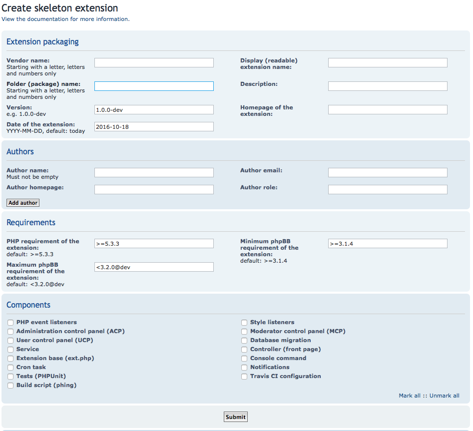

========================
phpBB Skeleton Extension
========================

The Skeleton Extension is a tool for extension developers. Its 
purpose is to kick start your extension development projects.

What is a skeleton? It's a working extension, based off the phpBB
Acme Demo extension. When you want to develop an extension, creating 
a skeleton will generate most of the initial files you would need,
so you don't have to.

This means you can jump straight into writing code for your extension,
and bypass the boring task of creating the initial files, methods
and docblocks yourself.

If you've never written an extension before, a skeleton provides an ideal way
to get started with your first one. Experienced developers will love it
too, no longer having to copy-paste code from their existing 
extensions in order to start up new ones.

All code generated by the Skeleton Extension is fully documented and
represents the phpBB Extension Team's best practices for extension coding.

Be sure to reference and familiarise yourself with phpBB's `extension
validation policies <https://www.phpbb.com/extensions/rules-and-policies/validation-policy/>`_
and `coding guidelines <https://area51.phpbb.com/docs/31x/coding-guidelines.html>`_.

How to install
==============

phpBB's Skeleton Extension is just like any other extension and is
installed into a phpBB board just the same as any other.

.. note::

    The Skeleton Extension is intended to be installed in a phpBB
    board used for offline/local development of extensions. It is
    not necessarily intended to be installed on live/production web
    sites.

Requirements
------------

-  A phpBB board, version 3.1.4 or newer (from the 3.1.x branch) or 3.2.0-b3 or newer (from the 3.2.x branch).
-  PHP version 5.3.9 or newer.
-  PHP ZipArchive module enabled.

Installation
------------

-  `Download the latest
   release <https://www.phpbb.com/customise/db/official_tool/ext_skeleton/>`__.
-  Unzip and install it to your phpBB ``ext/`` folder, e.g.:
   ``phpBB/ext/phpbb/skeleton``
-  In phpBB, go to "ACP" > "Customise" > "Extensions" and enable "phpBB
   Skeleton Extension".

Create an extension
===================

.. note::

    The Skeleton Extension is based on the Acme Demo extension. As a
    result, some of its files will have working classes and methods
    already. These are provided to make the skeleton both functional and
    educational. You will want to remove any Acme Demo code you do not
    need from the skeleton and replace it with your own custom code.

phpBB Web interface
-------------------

The easiest way to use the Skeleton Extension is from its web-based user
interface (UI).

In order to create an extension via the web UI, open the phpBB board you
installed this extension in and visit the "Create skeleton extension" link in the
board's navigation bar.

You will be presented with a form where you can enter information about
the extension you want to create. Complete the form and submit it.

A packaged ZIP file will begin to download in your browser.
Additionally, a copy of it can be found in ``phpBB/store/tmp-ext/``.

Unzip your skeleton extension and begin writing your own code.

Command line interface
----------------------

The Skeleton Extension can also accommodate users that prefer working
from a Command Line Interface (CLI).

In order to create an extension via the CLI, you need to open a console
on your server and ``cd`` to the root directory of the phpBB board where
you installed this extension:

.. code:: bash

    $ cd ./path/to/phpBB

To create an extension, run:

.. code:: bash

    $ ./bin/phpbbcli.php extension:create

You will be prompted to enter information about the extension you want
to create.

A packaged ZIP file will be saved to ``phpBB/store/tmp-ext/``.

Unzip your skeleton extension and begin writing your own code.

Documentation
=============

The following documentation describes how to use the Skeleton Extension
to configure and generate a skeleton that will suit your needs, so you
can jump straight into writing your own code.

Extension packaging
-------------------

Extensions are packaged in a directory structure as follows: ``vendorname/extensionname``.
For example, the Acme Demo extension uses a packaging structure that looks like ``acme/demo``.

Vendor name
^^^^^^^^^^^

The vendor name can be your username or any other name you choose to associate 
your extensions with. Valid naming conventions must start with a letter and
contain letters and numbers only. In the case of the Acme Demo extension, 
this would be ``acme``. **This field is required.**

Package name
^^^^^^^^^^^^

The package name is the name of the extension. Valid naming conventions must
start with a letter and contain letters and numbers only. In the case of the 
Acme Demo extension, this would be ``demo``. **This field is required.**

Display name
^^^^^^^^^^^^

This is the name (or title) of your extension in plain English. This is what the user will
see when your extension appears in the phpBB ACP Extension Manager. In the case of the 
Acme Demo extension, this would be ``Acme Demo``. **This field is required.**

Description
^^^^^^^^^^^

A brief description of your extension. This will be visible to users in the Details page
of your extension in phpBB's ACP Extension Manager.

Version
^^^^^^^

The version of your extension. phpBB's coding guidelines require an ``x.y.z`` semantic 
versioning format, with optional ``-dev``, ``-alpha``, ``-beta`` and ``-RC`` pre-release suffixes.
When left blank, the Skeleton Extension will use ``1.0.0-dev`` by default.

Date of the extension
^^^^^^^^^^^^^^^^^^^^^

Date the extension is released. Dates must be in the ``YYYY-MM-DD`` format.
When left blank, the Skeleton Extension will use the current date by default.

Homepage of the extension
^^^^^^^^^^^^^^^^^^^^^^^^^

An optional link to your extension's homepage. This can be, for example, an extension's
GitHub repository or any other site related to your extension.

Authors
-------

Here you can name your extension's author(s). Use the ``Add author`` button
to add additional authors.

Author name
^^^^^^^^^^^

The name of an extension's author. Must not be empty.

Author email
^^^^^^^^^^^^

The email address of an extension's author. (Optional)

Author homepage
^^^^^^^^^^^^^^^

The homepage URL of an extension's author. (Optional)

Author role
^^^^^^^^^^^

The role of an extension's author. For example, lead developer, contributor, 
translator, etc. (Optional)

Requirements
------------

Requirements are where you define the minimum (and maximum) PHP and phpBB versions
your extension needs to be able to perform.

Minimum phpBB requirement of the extension
^^^^^^^^^^^^^^^^^^^^^^^^^^^^^^^^^^^^^^^^^^

Typically this should be set to the version of phpBB in which you are developing
and testing your extension.

The version should be defined using `Composer's version 
constraints <https://getcomposer.org/doc/articles/versions.md>`_. 

For example, to require phpBB 3.1.4 or greater, use ``>=3.1.4``.

Maximum phpBB requirement of the extension
^^^^^^^^^^^^^^^^^^^^^^^^^^^^^^^^^^^^^^^^^^

To mitigate compatibility breaks, it is common to set the maximum version
to the next major release version of phpBB.

For example, if your extension is being developed for phpBB 3.1.x, you can
set the maximum requirement to phpBB 3.2.x by using ``<3.2.0@dev``.

.. note::

    Currently, phpBB does not automatically enforce the minimum and maximum
    requirements. However, it will begin enforcing it in a future release.
    In the meantime, it is possible to use the ``is_enableable()`` method
    in the ``ext.php`` class to `enforce the minimum and maximum requirements
    <https://github.com/phpbb-extensions/boardrules/blob/master/ext.php#L29-L43>`_.

PHP requirement of the extension
^^^^^^^^^^^^^^^^^^^^^^^^^^^^^^^^

Since your extension will operate within phpBB, it's often safe to assume
that your extension will share the same minimum PHP requirement as phpBB
does. Thus, by default, this field will use ``>=5.3.3`` unless you enter
an alternative version.

.. note::

    You can find phpBB's PHP requirements by looking at its composer.json file.

Components
----------

The default Skeleton Extension outputs a license file and composer.json.
The Components section allows you to choose from a variety of typical
components an extension could need, such as an ACP module, migrations,
events, and tasks such as cron, CLI and notifications. The files
generated for these components are simple yet fully working examples
based off the Acme Demo extension. They are intended to give you a
consistent and phpBB code-ready starting point, so you can focus more
on writing your code and less on file structure and organization.

PHP event listeners
-------------------

PHP event listeners work with core events to inject code into phpBB.
Core events are like hooks, and they can be found throughout phpBB's
codebase at key points. They give your extension access to phpBB's
variables and allow you to use and modify them or to inject additional
PHP code during phpBB's execution.

The Skeleton Extension will generate a sample event listener PHP file
and necessary services YAML file:

::

    vendor
    ├── package
    │   ├── config                 # The config dir contains all service config files
    │   │   ├── services.yml       # A config YAML file
    │   │   └── ...
    │   ├── event                  # The event dir contains all PHP event listeners
    │   │   ├── main_listener.php  # A sample PHP event listener
    │   │   └── ...
    │   └── ...
    └── ...

Style event listeners
---------------------

Style listeners use template events to inject HTML, JS and CSS into
phpBB’s style files. Style listeners must be located in a directory
named ``event`` to be recognized as a template event. All files outside
the ``event`` dir are seen as standard style files.

``all/`` Directory contains style files that can be used by any/all
styles.

``prosilver/`` Directory contains style files specifically for prosilver
(and any styles that inherit from prosilver).

``subsilver2/`` Directory contains style files specifically for
subsilver2 (and any styles that inherit from subsilver2).

The Skeleton Extension will generate a sample template event listener
HTML file for prosilver:

::

    vendor
    ├── package
    │   ├── styles                         # The styles dir
    │   │   ├── prosilver                  # Dir containing prosilver style files
    │   │   │   ├── template               # Dir containing HTML template files
    │   │   │   │   ├── event              # Dir containing template event files
    │   │   │   │   │   ├── overall_header_navigation_prepend.html  # A template event
    │   │   │   │   │   └── ...
    │   │   │   │   └── ...
    │   │   │   └── ...
    │   │   └── ...
    │   └── ...
    └── ...

Administration control panel (ACP)
----------------------------------

Add a functional ACP module for an extension to the ACP’s Extensions
tab.

The Skeleton Extension will generate all the files needed for a
functioning ACP module including its migration, language, style and PHP
files:

::

    vendor
    ├── package
    │   ├── acp                          # Dir containing ACP module PHP files
    │   │   ├── main_info.php            # Module information
    │   │   ├── main_module.php          # Module execution logic
    │   │   └── ...
    │   ├── adm                          # Dir containing ACP module HTML templates
    │   │   ├── style                    # ACP templates are loaded from the style dir
    │   │   │   ├── acp_demo_body.html   # Sample ACP HTML template file
    │   │   │   └── ...
    │   │   └── ...
    │   ├── language                     # Dir containing language files
    │   │   ├── en                       # English language files (required)
    │   │   │   ├── common.php           # A language file used by the extension
    │   │   │   ├── info_acp_demo.php    # An auto-loaded lang file for ACP modules
    │   │   │   └── ...
    │   │   └── ...
    │   ├── migrations                   # Dir containing migration files
    │   │   ├── install_acp_module.php   # A migration installing the ACP module
    │   │   └── ...
    │   └── ...
    └── ...

.. note::

    The ACP is not yet part of phpBB's container-based dependency
    injection system, so it does not utilise a services YAML file.

Moderator control panel (MCP)
-----------------------------

Add a functional MCP module for an extension to the MCP.

The Skeleton Extension will generate all the files needed for a
functioning MCP module including its migration, language, style and PHP
files:

::

    vendor
    ├── package
    │   ├── language                        # Dir containing language files
    │   │   ├── en                          # English language files (required)
    │   │   │   ├── info_mcp_demo.php       # An auto-loaded lang file for MCP modules
    │   │   │   └── ...
    │   │   └── ...
    │   ├── mcp                             # Dir containing MCP module PHP files
    │   │   ├── main_info.php               # Module information
    │   │   ├── main_module.php             # Module execution logic
    │   │   └── ...
    │   ├── migrations                      # Dir containing migration files
    │   │   ├── install_mcp_module.php      # A migration installing the MCP module
    │   │   └── ...
    │   ├── styles                          # The styles dir
    │   │   ├── prosilver                   # Dir containing prosilver style files
    │   │   │   ├── template                # Dir containing HTML template files
    │   │   │   │   ├── mcp_demo_body.html  # Sample MCP HTML template file
    │   │   │   │   └── ...
    │   │   │   └── ...
    │   │   └── ...
    │   └── ...
    └── ...

.. note::

    The MCP is not yet part of phpBB's container-based dependency
    injection system, so it does not utilise a services YAML file.

User control panel (UCP)
------------------------

Add a functional UCP module for an extension to the UCP.

The Skeleton Extension will generate all the files needed for a
functioning UCP module including its migration, language, style and PHP
files:

::

    vendor
    ├── package
    │   ├── language                        # Dir containing language files
    │   │   ├── en                          # English language files (required)
    │   │   │   ├── info_ucp_demo.php       # An auto-loaded lang file for UCP modules
    │   │   │   └── ...
    │   │   └── ...
    │   ├── migrations                      # Dir containing migration files
    │   │   ├── install_ucp_module.php      # A migration installing the UCP module
    │   │   ├── install_user_schema.php     # Contains changes used in the new module
    │   │   └── ...
    │   ├── styles                          # The styles dir
    │   │   ├── prosilver                   # Dir containing prosilver style files
    │   │   │   ├── template                # Dir containing HTML template files
    │   │   │   │   ├── ucp_demo_body.html  # Sample UCP HTML template file
    │   │   │   │   └── ...
    │   │   │   └── ...
    │   │   └── ...
    │   ├── ucp                             # Dir containing UCP module PHP files
    │   │   ├── main_info.php               # Module information
    │   │   ├── main_module.php             # Module execution logic
    │   │   └── ...
    │   └── ...
    └── ...

.. note::

    The UCP is not yet part of phpBB's container-based dependency
    injection system, so it does not utilise a services YAML file.

Database migration
------------------

Migration files are used to make database changes. This includes adding
data to tables and schema changes (which are changes to the database's
tables and columns).

The Skeleton Extension will generate all of its sample migration files:

::

    vendor
    ├── package
    │   ├── migrations                      # Dir containing migration files
    │   │   ├── install_acp_module.php      # A migration installing the ACP module
    │   │   ├── install_mcp_module.php      # A migration installing the MCP module
    │   │   ├── install_ucp_module.php      # A migration installing the UCP module
    │   │   ├── install_user_schema.php     # Sample schema changes to the database
    │   │   └── ...
    │   └── ...
    └── ...

Service
-------

The Service component is a PHP class that does something behind the
scenes. It is a class that can be accessed by controllers, event
listeners, or control panel modules.

The Skeleton Extension will generate a sample class that simply returns
the current user object. It shows how to use dependency injection for
services and parameters, thus it includes sample config and parameter
YAML files:

::

    vendor
    ├── package
    │   ├── config              # The config dir contains all service config files
    │   │   ├── parameters.yml  # A parameter YAML file
    │   │   ├── services.yml    # A config YAML file
    │   │   └── ...
    │   ├── service.php         # A sample PHP file that contains a class/object
    │   └── ...
    └── ...

Controller (front page)
-----------------------

Controllers are typically used for front-facing files/classes. They
run the code that produces a new and complete page that the user will
interact with. Examples of front-facing pages an extension may use
include a news page, a blog, a FAQ, etc.

The Skeleton Extension generates a front-facing page that displays a
"Hello world" message to the user. Included with this component are
the HTML template file for the page, PHP and template event listeners
(to demonstrate adding a link to the new page in the nav bar), the
language file, and the config and routing YAML files:

::

    vendor
    ├── package
    │   ├── config              # The config dir contains all service config files
    │   │   ├── routing.yml     # A routing YAML file
    │   │   ├── services.yml    # A config YAML file
    │   │   └── ...
    │   ├── controller             # Dir containing controller files
    │   │   ├── main.php           # A sample controller class
    │   │   └── ...
    │   ├── event                  # The event dir contains all PHP event listeners
    │   │   ├── main_listener.php  # A sample PHP event listener
    │   │   └── ...
    │   ├── language               # Dir containing language files
    │   │   ├── en                 # English language files (required)
    │   │   │   ├── common.php     # A language file used by the extension
    │   │   │   └── ...
    │   │   └── ...
    │   ├── styles                      # The styles dir
    │   │   ├── prosilver               # Dir containing prosilver style files
    │   │   │   ├── template            # Dir containing HTML template files
    │   │   │   │   ├── demo_body.html  # An HTML template used by the controller
    │   │   │   │   └── ...
    │   │   │   └── ...
    │   │   └── ...
    │   └── ...
    └── ...

Extension base (ext.php)
------------------------

The optional ``ext.php`` file can be used to run code before or during
extension installation and removal operations. This is most useful if
your extension needs to run code when it is enabled, disabled, or
purged. Extensions have also used it to check if phpBB satisfies the
requirements of the extension before proceeding with installation, to
define class constants, and more.

The Skeleton Extension will generate a sample ``ext.php`` class. This class
is empty by default but can be populated with methods when used with
other components (such as Notifications):

::

    vendor
    ├── package
    │   ├── ext.php  # A sub class. The class and file name can not be changed.
    │   └── ...
    └── ...

Console command
---------------

Extensions can add their own commands to phpBB's command line interface
(CLI). This is useful for extension that can provide additional terminal
commands to perform certain actions.

The Skeleton Extension will generate a simple CLI command, including the
necessary language and config files:

::

    vendor
    ├── package
    │   ├── config             # The config dir contains all service config files
    │   │   ├── services.yml   # A config YAML file
    │   │   └── ...
    │   ├── console            # Dir containing CLI related classes
    │   │   ├── command        # Dir containing CLI command classes
    │   │   │   ├── demo.php   # A sample CLI command class
    │   │   │   └── ...
    │   │   └── ...
    │   ├── language           # Dir containing language files
    │   │   ├── en             # English language files (required)
    │   │   │   ├── cli.php    # A language file used by the extension
    │   │   │   └── ...
    │   │   └── ...
    │   └── ...
    └── ...

Cron task
---------

A cron task allows an extension to schedule and run actions at specific
time intervals.

The Skeleton Extension will generate a simple cron task, including the
necessary migration and config files:

::

    vendor
    ├── package
    │   ├── config             # The config dir contains all service config files
    │   │   ├── services.yml   # A config YAML file
    │   │   └── ...
    │   ├── cron               # Dir containing cron related classes
    │   │   ├── task           # Dir containing cron task classes
    │   │   │   ├── demo.php   # A sample cron task class
    │   │   │   └── ...
    │   │   └── ...
    │   ├── migrations            # Dir containing migration files
    │   │   ├── install_cron.php  # A migration installing cron related data
    │   │   └── ...
    │   └── ...
    └── ...

Notifications
-------------

Notifications allow an extension to notify users of specific activities
through phpBB's notification system.

The Skeleton Extension will generate a sample notification, including
the necessary language and config files. Additionally it will generate
an ``ext.php`` file with important actions that must run during an
extension's enable, disable and purge steps:

::

    vendor
    ├── package
    │   ├── config             # The config dir contains all service config files
    │   │   ├── services.yml   # A config YAML file
    │   │   └── ...
    │   ├── ext.php                   # Contains enable, disable and purge steps
    │   ├── language                  # Dir containing language files
    │   │   ├── en                    # English language files (required)
    │   │   │   ├── common.php        # A language file used by the extension
    │   │   │   ├── info_ucp_demo.php # A UCP language file used by the notification
    │   │   │   └── ...
    │   │   └── ...
    │   ├── notification       # Dir containing notification related classes
    │   │   ├── type           # Dir containing notification types
    │   │   │   ├── demo.php   # A sample notification type class
    │   │   │   └── ...
    │   │   └── ...
    │   └── ...
    └── ...

Tests (PHPUnit)
---------------

Unit tests can test an extension to verify that specific portions of its
source code work properly. This helps ensure basic code integrity and
prevents regressions as an extension is being developed and debugged.

The Skeleton Extension will generate some basic sample unit and
functional tests:

::

    vendor
    ├── package
    │   ├── phpunit.xml.dist          # A PHPUnit configuration file (do not edit)
    │   ├── tests                     # Dir containing test scripts
    │   │   ├── controller            # Example dir containing controller tests
    │   │   │   ├── main_test.php     # A simple unit test (tests a controller class)
    │   │   │   └── ...
    │   │   ├── dbal                  # Example dir containing dbal tests
    │   │   │   ├── fixtures          # Dir containing database test fixtures
    │   │   │   │   ├── config.xml    # A database test fixture of the config table
    │   │   │   │   └── ...
    │   │   │   ├── simple_test.php   # A simple test (tests a database interaction)
    │   │   │   └── ...
    │   │   ├── functional            # Dir containing functional tests
    │   │   │   ├── demo_test.php     # A simple functional test
    │   │   │   └── ...
    │   │   └── ...
    │   └── ...
    └── ...

Travis CI configuration
-----------------------

Travis CI is a platform for running your PHPUnit tests on a GitHub
repository.

The Skeleton Extension will generate the basic config and script files
needed to test your phpBB extension with each commit and pull request
pushed to your GitHub repository:

::

    vendor
    ├── package
    │   ├── .travis.yml           # A Travis CI configuration file
    │   ├── tests                 # Dir containing PHPUnit tests
    │   ├── travis                # Dir containing Travis CI scripts
    │   │   ├── prepare-phpbb.sh  # Script required by Travis CI during testing (do not edit)
    │   │   └── ...
    │   └── ...
    └── ...

.. warning::

    The ``.travis.yml`` is a hidden file. You can view and edit it
    using a Text Editor or IDE that is capable of displaying hidden
    files.

.. note::

    The Skeleton Extension currently does not allow you to generate
    the Travis CI component without also generating the PHPUnit tests
    component. This is because without unit tests, there is little
    benefit to using Travis CI.

Build script (phing)
--------------------

A phing build script is generated for your extension which can be used
to generate build packages to help simplify the release or deployment
process.

For example, when you are ready to release a version of your extension,
running the build script will package your extension in the appropriate
vendor/package format and generate a ZIP file ready to submit to phpBB's
Customisation Database. It can also clean out files not intended for
distribution such as unit tests and hidden Git files.

To run the build script, use the following console commands:

.. code:: bash

    # Navigate to the root of your extension
    $ cd ./path/to/phpBB/vendor/package

    # If you don't already have phing installed, get from composer:
    $ php ./path/to/composer.phar install

    # Run phing:
    $ ./vendor/bin/phing

After phing successfully completes its process, a ``build`` folder will
be added to your repository:

::

    vendor
    ├── package
    │   ├── build.xml     # A phing build configuration file
    │   ├── build         # Dir used by the build process
    │   │   ├── checkout  # A zipped archive of your current Git repository
    │   │   ├── package   # The packaged extension, as built by phing
    │   │   ├── upload    # The packaged extension, zipped for distribution
    │   │   └── ...
    │   └── ...
    └── ...

.. warning::

    Never commit the build directory to Git or your repository.
    You should add ``build/`` to your ``.gitignore`` to ensure Git
    ignores this directory.
